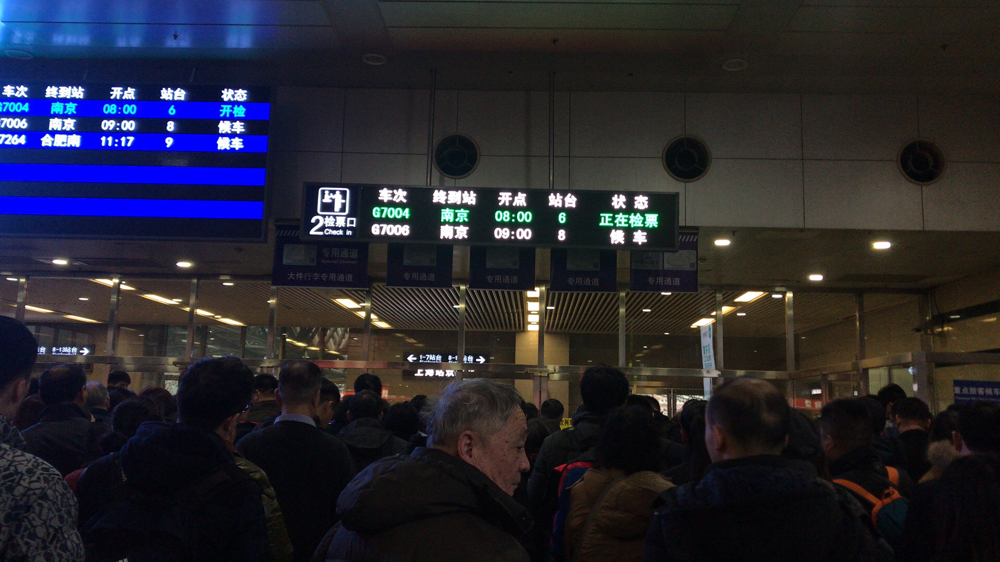
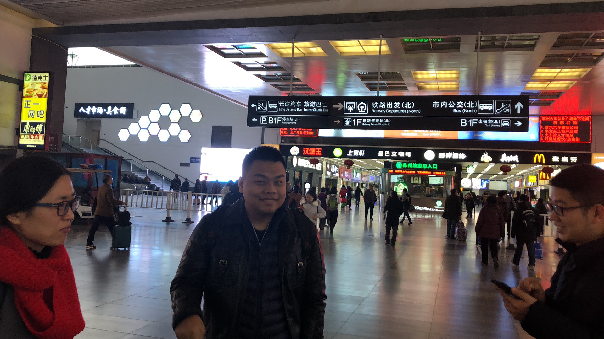
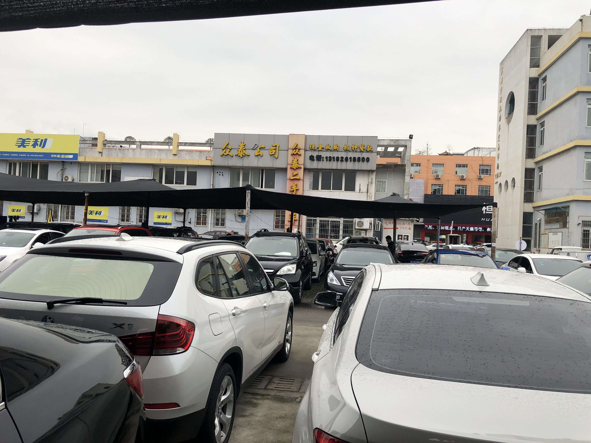
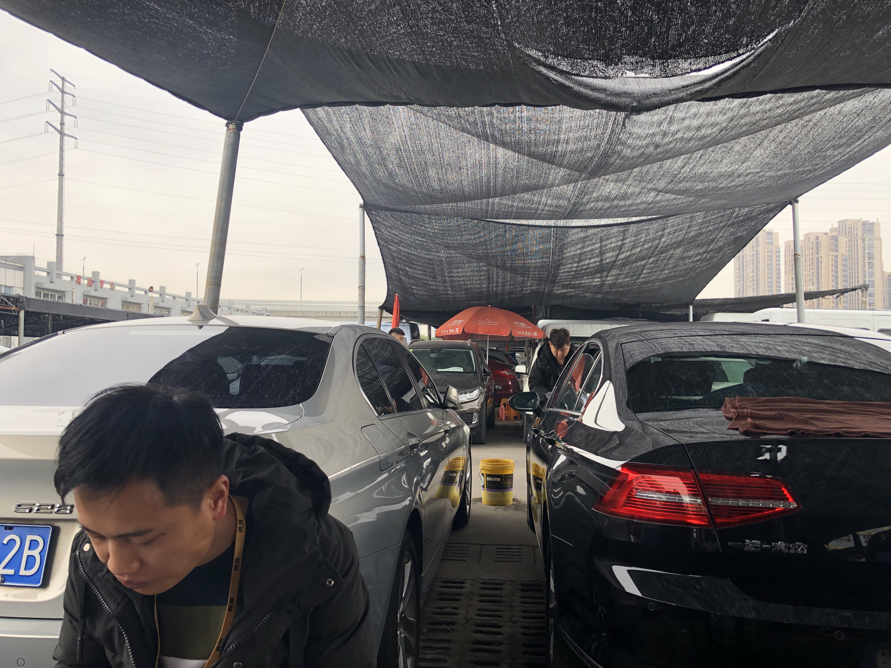
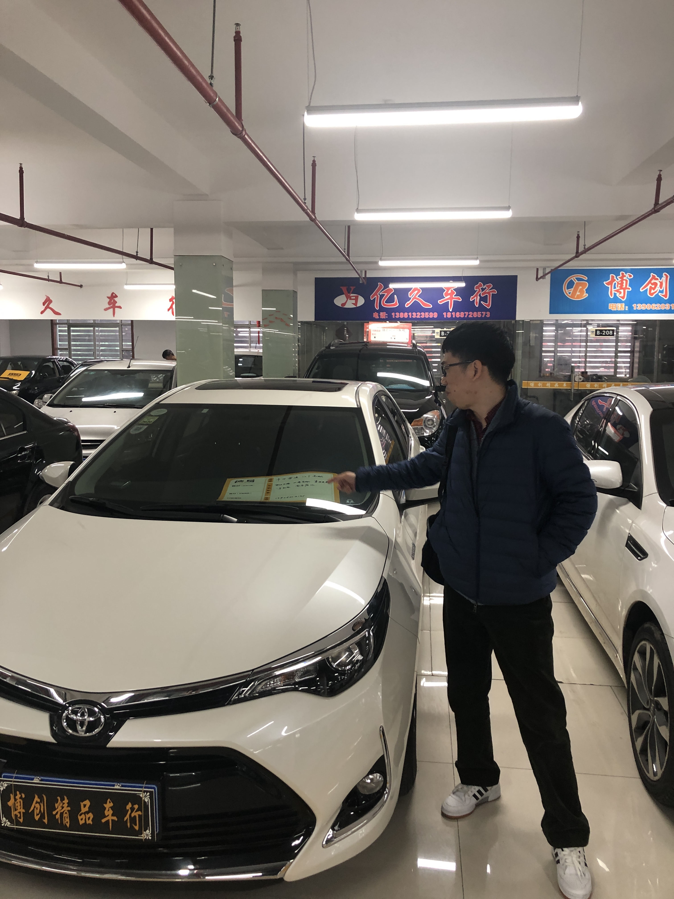
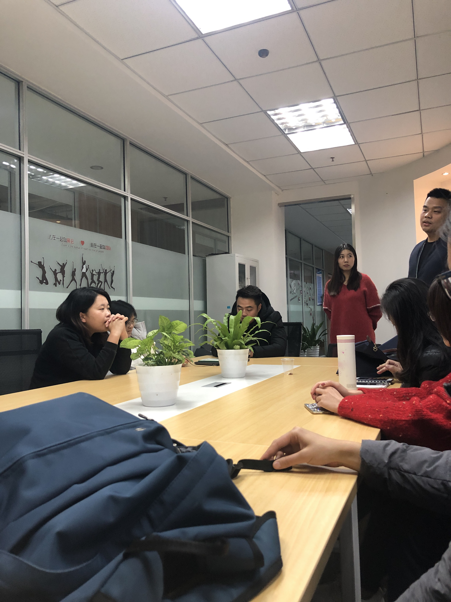

### 紧凑高效的苏州行
坐在办公室时，我努力的理解由前线人员反馈给主管再由主管通过PDCA会议紧凑的反馈给产品经理的需求。努力的模拟着我所要设计的功能真实的场景以及场景之外的异常情况。“应该出去看看”，我时常在想。我们不断在了解竞品公司的营销方案和系统设计，极力保证我们是走在“提高人效”的路上。但是实际场景是不是如我所想像的那样？
2018年12月15日我有幸成为苏州市场行的一员，通过紧凑高效的一天我们不光了解了竞品公司系统在市场上的反响，还从市场定价策略、市场促销策略和市场品牌策略等方面对公司在市场中有了更立体的认识。
### 冷清的车市场温暖的交谈
早会破冰后我跟随结对的销售文杰走在去市场的路上。路程不远，1公里的路上我听他讲述了昨天因为实名认证问题导致订单被卡在晚上8点50分才放款的遭遇。“这个车商肯定做不了”，他无奈的笑笑说道。他又补充道，“公司风控做的严是应该的，这是为了我们好”。
到达市场，因为是周六的缘故看起来冷冷清清的，偌大的市场里只有稀稀拉拉的人在擦车看车。我们进到一家车商里面和老板寒暄了几句便坐下看历史做过的订单。打开手机文杰看见需要更新跟我说“你看，有更新一直在更新，更新说明又会让我们省很多事情”，他看了看更新列表然后点击更新后又说道，“上次上线了一个GPS免录，扫一下GPS条码就有信息了，特别方便”。听到这番话让我触动很大，让我想起了常说的那句话，“前端不负后端，后端不负前端”。
我们走访了周边的车商聊了聊市场的规模、车辆品质以及购车群体等情况。看着琳琅满目的车辆以及文杰对公司的前景的看好让我在这个冷清的市场有了温暖的感觉。
### 畅所欲言的交流
下午，我们回到办公室，对上午的所见所闻进行了简单的交流。然后和苏州城市经理周尔刚聊了聊苏州的市场背景以及他们在当地的策略。从谈话中我们了解到苏州市场因为私人代理和竞品公司的恶意返点让整个行业都举步维艰，我们公司的在市场上的产品策略和风控策略还没有形成独特的风格。这就导致车商在向客户推荐金融方案时很难第一时间想到我们公司，我们能做的就是尽量提高我们使用体验通过客情维护让更多的车商记得我们。
另外我们还了解到我们的一些提单策略和其他公司略有不同，很多时候在订单都已经走到签约阶段突然被拒绝，这让客户体验非常不好。
对最近新做的抵押系统尔刚也有一些看法，说道，“有不少抵押专员和运营反馈新系统不太好用”。对此我解释因为我们的抵押流程之前一直在线下处理，突然搬到线上肯定大家会有些不适应。如果使用一段时间后有任何异常或不理解的地方都可以及时反馈，共同打造一套易用的系统。
从交流中我们还从同事口中了解到了其他公司的产品的一些特点，认识到我们现阶段还有很多不足。也让我们从后端走到了前端更加立体的了解了我们公司。
### 行程掠影

清晨出发

到达苏州

走访市场

走访市场

德易的车辆介绍牌

畅所欲言的交流
