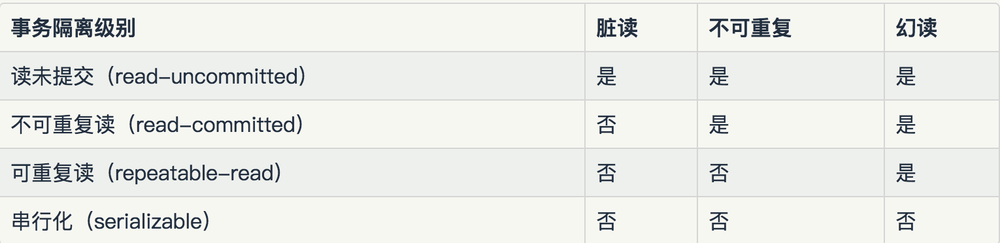

### 1. 事务
MySQL 事务主要用于处理操作量大，复杂度高的数据。比如说，在人员管理系统中，你删除一个人员，你即需要删除人员的基本资料，也要删除和该人员相关的信息，如信箱，文章等等，这样，这些数据库操作语句就构成一个事务！
>* 在 MySQL 中只有使用了 Innodb 数据库引擎的数据库或表才支持事务。
>* 事务处理可以用来维护数据库的完整性，保证成批的 SQL 语句要么全部执行，要么全部不执行。
>* 事务用来管理 INSERT/UPDATE/DELETE 语句   

#### 1.1. 事务特性
原子性（**A** tomicity，或称不可分割性）、一致性（**C** onsistency）、隔离性（**I** solation，又称独立性）、持久性（**D** urability）。
>* 原子性：一个事务（transaction）中的所有操作，要么全部完成，要么全部不完成，不会结束在中间某个环节。事务在执行过程中发生错误，会被回滚（Rollback）到事务开始前的状态，就像这个事务从来没有执行过一样。
>* 一致性：在事务开始之前和事务结束以后，数据库的完整性没有被破坏。这表示写入的资料必须完全符合所有的预设规则，这包含资料的精确度、串联性以及后续数据库可以自发性地完成预定的工作。
>* 隔离性：数据库允许多个并发事务同时对其数据进行读写和修改的能力，隔离性可以防止多个事务并发执行时由于交叉执行而导致数据的不一致。事务隔离分为不同级别，包括读未提交（Read uncommitted）、读提交（read committed）、可重复读（repeatable read）和串行化（Serializable）。
>* 持久性：事务处理结束后，对数据的修改就是永久的，即便系统故障也不会丢失。

#### 1.2. 事务并发问题
>* **脏读：** 事务 A 读取了事务 B 更新的数据，然后B回滚操作，那么 A 读取到的数据是脏数据
>* **不可重复读：** 事务 A 多次读取同一数据，事务 B 在事务 A 多次读取的过程中，对数据作了更新并提交，导致事务 A 多次读取同一数据时，结果不一致。
>* **幻读：** 系统管理员 A 将数据库中所有学生的成绩从具体分数改为 ABCDE 等级，但是系统管理员 B 就在这个时候插入了一条具体分数的记录，当系统管理员 A 改结束后发现还有一条记录没有改过来，就好像发生了幻觉一样，这就叫幻读。

### 2. 隔离级别
**读未提交**
事务的最低隔离级别，在这种隔离级别下，一个事务可以读取另外一个事务未提交的数据。
 
事务 T 在读数据的时候并未对数据进行加锁，事务 T 在修改数据的时候对数据增加行级共享锁
T1 在读取数据时，T2 可以对相同数据进行读取、修改。因为 T1 没有进行任何锁操作；当 T2 对记录进行修改时，T1 再次读取数据可以读取到 T2 修改后的数据。因为 T2  对数据进行修改只增加了行级共享锁，T1 可以再增加共享读锁进行数据读取（尽管 T2 没有提交事务）

如上所述，这种隔离级别，会导致脏读现象。

**读已提交**
在一个事务修改数据过程中，如果事务没有进行提交，其他事务不能读取该数据。

事务T在读取数据时增加行级共享锁，读取一旦结束，立即释放；事务T在修改数据时增加行级排他锁，直到事务结束才释放。
T1 在读取数据的过程中，T2 也可以对相同数据进行读取，但是不能进行修改（ T1 增加的是共享锁，T2 也可以增加共享锁，但是不能增加排他锁）。T1 读取结束后，会立即释放共享锁，这时 T2 可以增加排他锁，对数据进行修改，而此时 T1 既不能对数据进行读取也不能进行修改，直到 T2 事务结束。

如上所述，这种隔离级别，解决了脏读问题，但是不能解决不可重复读现象。

**可重复读**
事务T在数据读取时，必须增加行级共享锁，直到事务结束；事务T在修改数据过程中，必须增加行级排他锁，直到数据结束。

T1 在读取数据的过程中，T2 也可以对相同数据进行读取，但是不能进行修改（ T1 增加的是共享锁，T2 也可以增加共享锁，但是不能增加排他锁）。直到 T1 事务结束后，才会释放共享锁，这时 T2 才可以增加排他锁，对数据进行修改。

如上所述，这种隔离级别，解决了不可重复读现象，但是这种隔离级别解决不了幻读的问题

T1 进行查询，读取了10条记录，并对十条记录增加了行级锁，此时 T2 是无法对这10行数据进行修改操作的，但是由于没有表级锁，它可以增加一条满足 T1 查询条件的记录。随后 T1 在进行查询时，会发现虽然10条记录没有改变，但是突然多了一条记录。

**串行化**
产生幻读是由于没有进行范围查询时没有增加范围锁。

事务 T 在读取数据时，必须先增加表级共享锁，直到事务结束才释放；事务 T 在修改数据时，必须先增加表级排他锁，直到事务结束才释放。

T1 在读取 A 表时，增加了表级共享锁，此时 T2 也可以读取 A 表，但是不能进行任何数据的修改，直到 T1 事务结束。随后 T2 可以增加对 A 表的表级排他锁，此时 T1 不能读取 A 表中的任何数据，更不能进行修改。

如上所述，可串行化解决了脏读、不可重复读、幻读等读现象，但是隔离级别越来越高的同时，在并发性上也就越来越低。

### 3. 锁
总的来说，InnoDB共有七种类型的锁：
>1. 共享/排它锁(Shared and Exclusive Locks)
>2. 意向锁(Intention Locks)
>3. 记录锁(Record Locks)
>4. 间隙锁(Gap Locks)
>5. 临键锁(Next-key Locks)
>6. 插入意向锁(Insert Intention Locks)
>7. 自增锁(Auto-inc Locks)

**共享锁/排它锁**
共享锁又称为读锁，简称 S 锁，顾名思义，共享锁就是多个事务对于同一数据可以共享一把锁，都能访问到数据，但是只能读不能修改。

排他锁又称为写锁，简称 X 锁，顾名思义，排他锁就是不能与其他所并存，如一个事务获取了一个数据行的排他锁，其他事务就不能再获取该行的其他锁，包括共享锁和排他锁，但是获取排他锁的事务是可以对数据就行读取和修改。

**意向锁**
意向锁分为意向共享锁和意向排他锁，InnoDB 实际应用中，使用的就是意向锁。

意向共享锁，简称 IS，其作用在于：通知数据库接下来需要施加什么锁并对表加锁。如果需要对记录 A 加共享锁，那么此时 InnoDB 会先找到这张表，对该表加意向共享锁之后，再对记录 A 添加共享锁。

意向排他锁，简称 IX，其作用在于：通知数据库接下来需要施加什么锁并对表加锁。如果需要对记录 A 加排他锁，那么此时 InnoDB 会先找到这张表，对该表加意向排他锁之后，再对记录 A 添加共享锁。

**记录锁**
我们已经知道 InnoDB 的细粒度锁是实现在索引记录上的，InnoDB 的索引有两类，**聚集索引**与**二级索引**，InnoDB 每个表都会有一个聚集索引，如果定义了PK，那么PK就是聚集索引，如果没有定义PK那么第一个 unique index 是聚集索引，否则 InnoDB 会创建一个隐藏的 row-id 作为聚集索引。
聚集索引是如此重要，是因为 InnoDB 的索引和数据时存储在一起的，聚集索引的叶子节点存储的就是行记录。
而二级索引的叶子节点存储的是 PK 值，所以就导致了 InnoDB 的二级索引实际上会扫描两遍，第一遍由二级索引找到 PK，第二遍通过 PK 找到行记录。

**间隙锁**
间隙锁封锁的是索引记录中的间隔，间隙锁是在 MySQL 隔离级别是RR的时候才会生效，如果把数据库隔离级别降低到**读已提交**，间隙锁会自动失效。一般标准情况下**可重复读** 隔离级别下能解决不可重复读（当行修改）的问题，但是不能解决幻读的问题，但是InnoDB通过间隙锁，保证了对读取范围加锁，从而避免了幻读。

**临键锁**
临键锁是记录锁和间隙锁的组合，它的封锁范围既包含索引记录，也包含索引区间本身，临键锁的目的也是为了避免出现幻读。

**插入意向锁**
意向锁的一种，也称为**意向排它锁**。

**自增锁**
auto_increment在MySQL中很常见，通常会将主键ID设置为自增长，自增的幅度可以通过auto_increment_offset(起始数字)和auto_increment_increment(自增幅度，每次增加n个数字)两个参数进行控制，可以实现偶数自增以及奇数自增。

**总结**
InnoDB 的 select 操作是用快照读，可以提高读读并发
InnoDB 的 update 和 delete 操作为了保证数据的强一致，使用强互斥锁，保证同一行记录修改和删除的串行性。
InnoDB 使用插入意向锁，提高插入并发
InnoDB 使用间隙锁和临键锁可以避免幻读的发生
